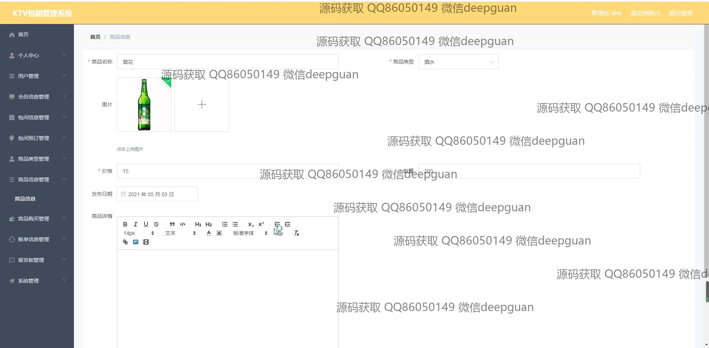

<h1 align="center">KTV包厢管理系统的设计与实现+vue</h1>

## 简介
KTV包厢管理系统：角色分为管理员、用户；提供包厢信息管理、会员信息管理、商品管理、留言管理等功能模块，支持预订、反馈、账单处理，实现高效的KTV运营管理。    --计算机毕业设计源码；毕设源码；java毕业设计源码

## 联系方式

<h3 align="center">获取完整代码与数据库文件 + 微信：deepguan QQ: 86050149 QQ群: 783742310</h3>

<h3 align="center">可帮忙远程部署 包运行成功！提供远程部署、修改代码、设计文档指导、代码讲解等服务！</h3>

## 功能介绍（完整见运行截图）
管理员：登录、注册、注销管理，系统主界面导航和功能模块管理，包厢信息和状态管理，用户和会员信息管理，商品类型和采购管理，包厢预约与审核管理，留言反馈查看与回复，账单信息管理与财务核算，发布活动与优惠资讯，上传与管理系统相关图片和文件。用户：通过注册登录系统，访问个人中心查看和更新个人信息，浏览并预订包厢，查看商品列表并购买商品，提交留言反馈，接收及使用特定折扣与优惠信息。

## 运行截图

本代码来源于网络,仅供学习参考使用!

